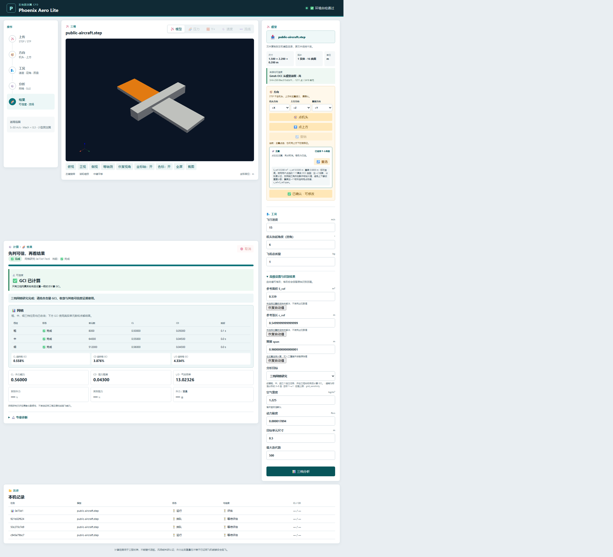
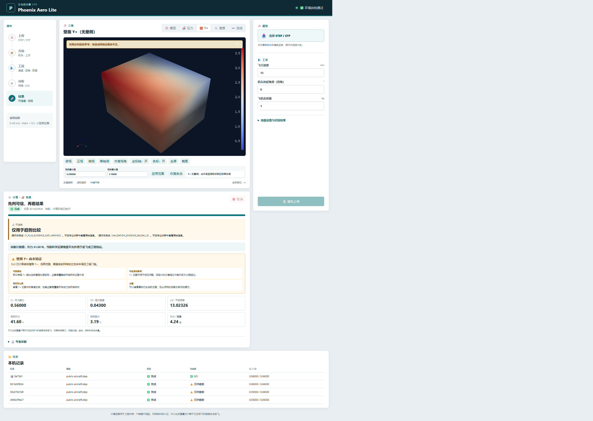

# 🚀 Phoenix Aero Lite

[](https://github.com/IAMFanxy13/Phoenix-Aero-Lite/actions/workflows/ci.yml)
[](https://www.python.org/)
[](LICENSE)
[](docs/validation/limitations.md)

**A local Windows CFD workbench for auditable preliminary fixed-wing aerodynamics.**

🇨🇳 [中文](README.md) · 📘 [Quick start](docs/QUICK_START.md) · 🧭 [User guide](docs/USER_GUIDE.md) · 🧪 [Scientific method](docs/SCIENTIFIC_METHOD.md) · ⚠️ [Known limitations](docs/validation/limitations.md)

> [!WARNING]
> Phoenix Aero Lite is **Alpha** software for geometry inspection, workflow learning, diagnostics and preliminary trend comparison. A completed process is not automatically converged or validated. It is not a substitute for wind-tunnel tests, flight tests or certification work.

## ✨ Highlights

- Import STEP/STP through Gmsh OpenCASCADE while keeping the source immutable.
- Pick real aircraft surfaces in 3D and derive wing reference area, chord and span with traceable manual overrides.
- Generate external-flow meshes and preserve physical groups, quality and near-wall evidence.
- Run the official SU2 executable with progress, cancellation, logs, task history and one bounded conservative retry.
- Inspect real Cp/static pressure, solved wall Y+, movable velocity slices and volume-field streamlines.
- Keep execution, convergence, mesh credibility, validation level and result permissions separate.

| Real wing-surface picking | Solved wall Y+ |
|---|---|
|  |  |

The screenshots use a public synthetic model and reproducible test arrays. They verify rendering, picking and scientific permission gates; they do not prove aerodynamic accuracy.

## ♻️ Reuse first

Phoenix orchestrates mature upstream tools instead of reimplementing them:

- **Gmsh + OpenCASCADE** for CAD import, geometry operations and meshing.
- **SU2** for RANS/SST flow solving.
- **meshio** for mesh/result interchange.
- **PyVista + VTK + Trame** for interactive scientific visualization.
- **FastAPI** for the loopback-only local workbench and task API.

Project-specific code focuses on parameter provenance, workflow automation, credibility gates, Chinese UX and reports. See the [open-source reuse audit](docs/research/open_source_reuse_audit.md).

## ⚡ Windows quick start

Requirements: Python 3.12, Git and the official SU2 8.5.0 Windows x64 OpenMP release.

```powershell
git clone https://github.com/IAMFanxy13/Phoenix-Aero-Lite.git
cd Phoenix-Aero-Lite
py -3.12 -m venv .venv
.\.venv\Scripts\python.exe -m pip install -e ".[dev]"
```

Record the absolute official `SU2_CFD.exe` path in ignored `config/local_tools.json` as described in the [Windows installation guide](docs/user/windows_installation.md), then double-click:

```text
Start_Phoenix_Aero_Lite.cmd
```

The launcher checks dependencies, SU2 and port availability before binding the local service to `127.0.0.1` and opening the browser.

## 🧪 Evidence boundary

The official SU2 NACA0012 SST coarse/medium/fine grid family converged independently. The fine result is `CL = 1.083985`, `CD = 0.0130319`; fine-grid GCI is `0.128%` for CL and `1.772%` for CD. This is **L3 numerical grid verification**, not complete experimental validation and not evidence that an arbitrary 3D aircraft result is correct.

Read the [benchmark matrix](docs/validation/benchmark-matrix.md), [numerical verification](docs/validation/numerical-verification.md) and [reproducibility guide](docs/REPRODUCIBILITY.md) before using results.

## 🛡️ Privacy and license

CAD, meshes and solver outputs stay local by default. Never attach private CAD, machine-local configuration or unsanitized job directories to public issues. See [privacy](docs/PRIVACY_AND_DATA.md) and [security](SECURITY.md).

Phoenix Aero Lite is licensed under `GPL-3.0-or-later`. Dependencies retain their own licenses; see [third-party notices](THIRD_PARTY_NOTICES.md) and the [license matrix](docs/legal/dependency-license-matrix.md).

Maintainer: Xinyu Fan.
